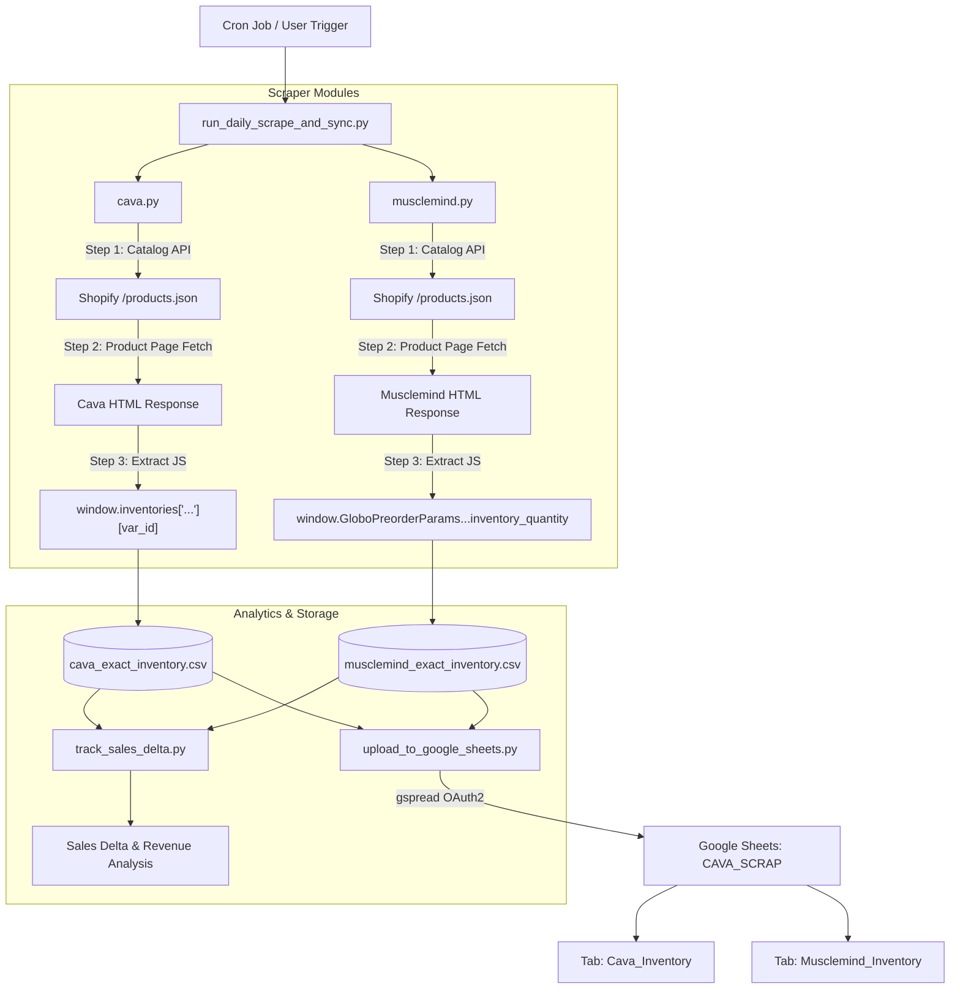

# 🛒 Shopify E-Commerce Inventory Scraper & Daily Analytics Engine
## Comprehensive Technical Architecture & API Documentation

---

## 📌 Executive Summary

This documentation details the technical design, reverse-engineering methodology, anti-bot bypass strategies, inventory delta calculation logic, and Google Sheets synchronization system built for monitoring competitor inventory and sales performance across Shopify e-commerce platforms (**Cava Athleisure** and **Musclemind**).

---

## 🛠️ Technology Stack & Libraries

| Technology / Library | Version | Purpose in Architecture |
| :--- | :--- | :--- |
| **Python** | `3.13` | Core execution environment & automation scripts. |
| **Cloudscraper** | `1.2.71+` | Emulates V8 JavaScript engines and Chrome browser TLS/JA3 fingerprints to bypass Cloudflare anti-bot challenge pages. |
| **Requests / Urllib3** | `2.31+` | Thread-safe HTTP request management & connection pooling. |
| **Concurrent Futures** | Built-in | Multithreaded execution (`ThreadPoolExecutor`) with thread-local session isolation. |
| **gspread** | `6.2.1` | Google Sheets API v4 client for automated spreadsheet dataset synchronization. |
| **Google Auth** | `2.x` | Service Account OAuth2 authentication using IAM service account keys. |
| **Pandas** | `2.x` | High-performance data manipulation, snapshot joining, and sales delta calculation. |
| **OpenPyXL** | `3.x` | Multi-tab formatted Excel (`.xlsx`) report generation. |

---

## 📐 System Architecture & Data Flow



---

## 🔬 Reverse-Engineering & Technical Extraction Logic

### 1. Cava Athleisure (`cava.py`)

#### Problem Statement
Shopify's default public catalog API (`/products.json`) exposes variant metadata (title, price, SKU, size), but hides exact backend stock quantities (`inventory_quantity`). Furthermore, Cava employs Cloudflare anti-bot security that returns HTTP status `429` / `403` challenge pages (*"Verifying your connection..."*) if requests are sent too fast.

#### Solution & Extraction Logic
1. **Catalog Paginated Discovery:** Fetch `/products.json?limit=250&page=X` using `Cloudscraper` to retrieve all ~980 products (~4,652 size variants).
2. **HTML JavaScript Extraction:** Cava's custom Shopify theme embeds exact stock numbers directly inside the HTML of product pages in a JavaScript variable:
   ```javascript
   window.inventories['10180314726649'][48802790670585] = {'quantity': 234, 'incoming': false};
   ```
3. **Cloudflare Protection Validation:** Before parsing, the script explicitly verifies the presence of `'window.inventories'` in `response.text`. If missing (indicating Cloudflare challenge interception), the thread-local Cloudscraper session is deleted and retried with exponential backoff & jitter (`2^attempt + random(0.5, 1.5)`s).

---

### 2. Musclemind (`musclemind.py`)

#### Problem Statement
Musclemind (`musclemind.com`) uses a modern Shopify theme that does not embed `window.inventories`. Bulk cart validation probes (`POST /cart/add.js`) trigger Cloudflare IP rate-limits when probed in fast loops.

#### Solution & Extraction Logic
1. **Globo Preorder App Reverse-Engineering:** Analysis of Musclemind product page HTML revealed that Musclemind installs the **Globo Preorder Shopify App**, which injects real inventory quantities into the DOM script tag:
   ```javascript
   window.GloboPreorderParams.product.variants[0] = {"id":48802790670585,"title":"Classic Blue / XS"...};
   window.GloboPreorderParams.product.variants[0].inventory_quantity = 30;
   ```
2. **Regex Parsing Engine:** The script uses Regex matchers to instantly extract variant IDs and corresponding `inventory_quantity` values from HTML in **~3 seconds flat**:
   ```python
   v_matches = re.findall(r'variants\[(\d+)\]\s*=\s*(\{.*?\});', html)
   q_matches = re.findall(r'variants\[(\d+)\]\.inventory_quantity\s*=\s*(-?\d+);', html)
   ```

---

## 📈 Inventory Sales Delta & Revenue Analytics Engine (`track_sales_delta.py`)

The analytics engine compares baseline inventory ($T_1$) with a subsequent inventory snapshot ($T_2$) to calculate sales performance:

### Analytical Formulations

1. **Stock Delta ($\Delta S$):**
   $$\Delta S = \text{Stock}_{T1} - \text{Stock}_{T2}$$

2. **Units Sold ($U_{\text{sold}}$):**
   $$U_{\text{sold}} = \begin{cases} \Delta S & \text{if } \Delta S > 0 \\ 0 & \text{otherwise} \end{cases}$$

3. **Units Restocked ($U_{\text{restocked}}$):**
   $$U_{\text{restocked}} = \begin{cases} |\Delta S| & \text{if } \Delta S < 0 \\ 0 & \text{otherwise} \end{cases}$$

4. **Estimated Revenue ($R$):**
   $$R = U_{\text{sold}} \times \text{Price}$$

---

## ☁️ Google Sheets API Integration (`upload_to_google_sheets.py`)

### IAM & Authentication Setup
* **Service Account Email:** `shopify-scrapper@shopifyscrap.iam.gserviceaccount.com`
* **Authentication Method:** OAuth2 Service Account JSON credentials (`/Users/turbom/Downloads/shopifyscrap-1fdcd0018d2e.json`).
* **Google API Scopes Used:**
  - `https://www.googleapis.com/auth/spreadsheets` (Google Sheets API v4)

### Update Strategy
1. Connects to target Google Sheet via URL (`open_by_url`) or ID (`open_by_key`).
2. Checks for target worksheet tabs (`Cava_Inventory`, `Musclemind_Inventory`). Creates tab if missing, or clears existing tab content (`worksheet.clear()`).
3. Batch uploads dataframe contents (`worksheet.update(data, 'A1')`) in a single API call to maximize rate limit efficiency.

---

## 🚀 Operations & Command Guide

### Master Daily Execution (Scrape + Google Sheets Sync)
```bash
cd /Users/turbom/Desktop/Alan/SHOPIFY_SCRAP
python3 run_daily_scrape_and_sync.py --sheet "https://docs.google.com/spreadsheets/d/1PLX9H5c3WA_vvM8HJQoK35ZHLBubLudHephx7T2lGjE/edit"
```

### Individual Scraper Commands
```bash
# Cava Scraper
python3 cava.py --sheet "https://docs.google.com/spreadsheets/d/1PLX9H5c3WA_vvM8HJQoK35ZHLBubLudHephx7T2lGjE/edit"

# Musclemind Scraper
python3 musclemind.py --sheet "https://docs.google.com/spreadsheets/d/1PLX9H5c3WA_vvM8HJQoK35ZHLBubLudHephx7T2lGjE/edit"
```

### Daily Sales Delta Excel Generator
```bash
python3 track_sales_delta.py --t1 cava_inventory_day1.csv --t2 cava_exact_inventory.csv --out Cava_Sales_Report.xlsx
```
